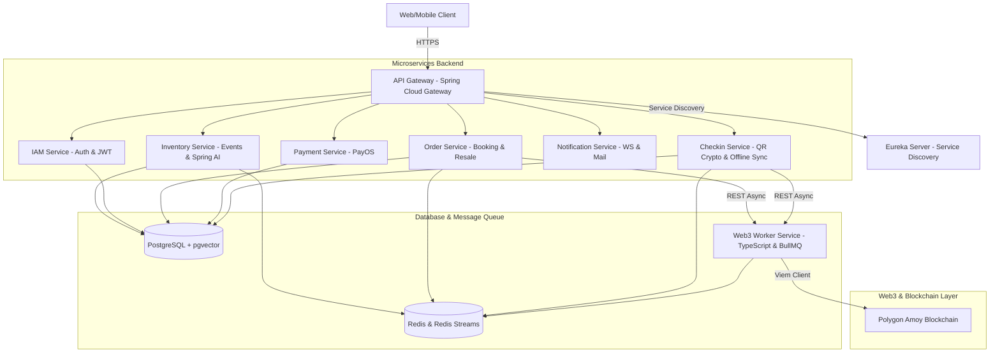

# 📝 Hướng Dẫn & Nội Dung Viết CV - Dự án EvoTicket

Chào bạn, dựa trên phân tích toàn bộ mã nguồn của dự án **EvoTicket**, đây là một hệ thống bán vé sự kiện hiện đại tích hợp công nghệ **Web3 (Blockchain)** để chống vé giả/chuyển nhượng an toàn và **Trí tuệ nhân tạo (AI RAG)** để hỗ trợ khách hàng thông minh. Hệ thống được phát triển theo kiến trúc **Microservices** chuẩn chỉnh với hiệu năng và độ bảo mật rất cao.

Dưới đây là bản tổng hợp chi tiết các công nghệ sử dụng, kiến trúc hệ thống và những gạch đầu dòng đắt giá đã được chuẩn hóa (cả tiếng Anh và tiếng Việt) để bạn đưa trực tiếp vào CV của mình.

---

## 🏗️ Kiến Trúc Hệ Thống & Tech Stack Tổng Quan

### 💻 Công nghệ sử dụng trong dự án (Tech Stack)
*   **Backend Core:** Java 21, Spring Boot 3.3.x, Spring Cloud (Gateway, Netflix Eureka, OpenFeign), Spring Security, OAuth2 Resource Server.
*   **Web3 & Blockchain:** TypeScript, Node.js, Viem (EVM Client), BullMQ (Queue management), Smart Contracts (ConcertTicket - ERC721A, User Wallet Factory), Polygon Testnet (Amoy).
*   **AI Integration:** Spring AI, Google Gemini API, pgvector (Vector Database), Tika Document Reader, TokenTextSplitter (RAG pipeline).
*   **Database & Caching:** PostgreSQL, Redis (Lettuce Client, Reactive Redis, Redis Streams).
*   **DevOps & CI/CD:** Docker, Docker Compose, Nginx (Reverse Proxy), Certbot (SSL), GitHub Actions (CI/CD pipelines with SonarQube Quality Gate, Docker Hub caching, Slack notifications).
*   **Other integrations:** PayOS Java SDK (Cổng thanh toán QR ngân hàng), Brevo/Sendinblue SDK (Email Transactional), Spring WebSocket (Real-time).

---

## 🛠️ Chi Tiết Đóng Góp Theo Từng Service

### 1. Checkin-Service (Bảo mật quét vé & Chế độ Offline)
*   **QR Cryptography:** Triển khai cơ chế tạo **dynamic QR code được ký số mật mã học** (JWS-like token structure) chứa thông tin vé, phiên bản QR và thời gian hết hạn (TTL). Ngăn chặn triệt để việc chụp ảnh vé chia sẻ hoặc làm giả vé.
*   **Offline Check-in Package:** Phát triển tính năng xuất gói dữ liệu offline (Offline Package) chứa mã hash SHA-256 để kiểm tra tính toàn vẹn dữ liệu, kèm theo public key để thiết bị quét vé tại sự kiện (nơi không có mạng internet) tự giải mã và **xác thực chữ ký số của QR Code offline**.
*   **Xử lý đồng bộ & Xung đột:** Sử dụng **Redis Streams** để lắng nghe sự kiện đồng bộ trạng thái vé bất tuần tự. Thiết kế hàm cập nhật trạng thái vé nguyên tử (atomic update) ở tầng database (`UPDATE ... WHERE accessStatus = VALID`) để ngăn chặn lỗi double check-in do quét vé đồng thời. Hỗ trợ cơ chế phát hiện và giải quyết xung đột (Conflict Resolution) khi đồng bộ hóa logs từ các máy quét offline lên server.

### 2. Web3-Worker-Service (Xử lý giao dịch Blockchain ngầm)
*   **Counterfactual Wallet (CREATE2):** Sử dụng Smart Contract Factory tích hợp cơ chế tính trước địa chỉ ví custodial của user (`predictAddress` qua CREATE2) dựa trên `userId`. Cho phép mint vé NFT trực tiếp tới ví của user ngay khi mua thành công mà không cần deploy ví trước, tiết kiệm tối đa chi phí gas và trì hoãn deploy (lazy deployment) cho tới khi user phát sinh giao dịch chuyển nhượng đầu tiên.
*   **BullMQ & Redis Queue:** Thiết kế kiến trúc **Fork-Join / Aggregation** sử dụng BullMQ. Khi nhận yêu cầu mint/update hàng loạt (ví dụ: order mua nhiều vé), hệ thống tách thành các job nhỏ chạy song song, sau đó dùng Redis để đếm và gộp kết quả. Khi tất cả vé hoàn thành on-chain, hệ thống tự động gửi 1 callback duy nhất về backend chính, giảm thiểu tải kết nối HTTP và tối ưu hóa thời gian xử lý.
*   **Viem Client & RPC Optimization:** Sử dụng Viem để giao tiếp với mạng Polygon. Triển khai giải thuật tìm kiếm chia đôi khoảng block (recursive binary log-splitting) để tự động vượt qua các giới hạn quét log (Rate limit/Block range) của RPC khi truy xuất lịch sử nguồn gốc vé (Ticket Provenance).

### 3. Inventory-Service (AI RAG & Quản lý Sự kiện)
*   **Spring AI & Google Gemini:** Phát triển chatbot hỗ trợ khách hàng thông minh tích hợp trực tiếp vào hệ thống.
*   **RAG (Retrieval-Augmented Generation):** Xây dựng pipeline xử lý tài liệu phi cấu trúc (PDF, Excel, Word...) bằng Tika Document Reader, cắt nhỏ văn bản và tạo Vector Embeddings để lưu trữ vào **pgvector (PostgreSQL)**, giúp Chatbot trả lời chính xác thông tin dựa trên dữ liệu sự kiện cập nhật.
*   **Function Calling (AI Tooling):** Đăng ký các Java method dưới dạng `@Tool` (EvoTicketTools). Cho phép mô hình Gemini tự quyết định gọi các hàm nghiệp vụ để truy vấn thông tin thực tế từ database (tìm sự kiện hot, danh mục, kiểm tra suất diễn, FAQ) và phản hồi thời gian thực một cách chính xác nhất.

### 4. Order-Service & Payment-Service (Đặt vé, Đặt chỗ & Secondary Market)
*   **Đặt chỗ thời gian thực (Redis Lock):** Áp dụng Redis để giữ chỗ (seat reservation) tạm thời trong quá trình thanh toán, ngăn ngừa tình trạng oversold (bán vượt quá số lượng ghế thực tế).
*   **Secondary Resale Market (Thị trường chuyển nhượng vé):** Thiết kế mô hình chợ vé thứ cấp an toàn. Vé sau khi mua có thể được ký gửi bán lại với chính sách kiểm soát giá trần/sàn để tránh đầu cơ. Sau khi thanh toán thành công, hệ thống tự động gọi Web3 Worker thực hiện transaction chuyển nhượng NFT on-chain (`safeTransferFrom`) và cập nhật trạng thái sở hữu (Ticket Provenance) chi tiết.
*   **Cổng thanh toán PayOS:** Tích hợp cổng PayOS bằng Java SDK để tạo link thanh toán QR chuyển khoản nhanh 24/7. Sử dụng **Spring Retry** để tự động thử lại các kết nối mạng bị lỗi trong quá trình xử lý webhook thanh toán, tăng độ tin cậy của giao dịch lên 99.9%.

### 5. API Gateway & Infrastructure
*   **Spring Cloud Gateway & Discovery:** Sử dụng Netflix Eureka Server để quản lý danh sách các microservice động. API Gateway thực hiện định tuyến phản ứng (reactive routing), tích hợp **Resilience4j Circuit Breaker** để cô lập sự cố khi có service bị sập.
*   **CI/CD & Monitoring:** Viết pipeline GitHub Actions tự động hóa quy trình kiểm thử, quét chất lượng code qua **SonarQube Quality Gate** (yêu cầu bảo mật đạt điểm A, không có blocker bug), build Docker image và deploy lên VPS thông qua SSH. Giám sát hệ thống thời gian thực bằng Prometheus, Grafana, và OpenTelemetry distributed tracing.

---

## 📝 Mẫu Trình Bày Dự Án Trong CV (Resume-Ready Bullet Points)

Dưới đây là hai phiên bản viết để đưa vào CV. Bạn nên chọn phiên bản phù hợp với phong cách CV của mình.

### 🇻🇳 PHIÊN BẢN TIẾNG VIỆT (Vietnamese Version)

#### **Dự án: EvoTicket – Hệ Thống Quản Lý & Phân Phối Vé Sự Kiện Ứng Dụng Web3 & AI**
*   **Vai trò:** Backend Developer / Fullstack Engineer
*   **Quy mô hệ thống:** Hệ thống phân tán microservices xử lý lưu lượng đặt vé cao, tích hợp blockchain Polygon và trợ lý AI thông minh.
*   **Công nghệ sử dụng:** Java 21, Spring Boot, Spring Cloud (Gateway, Eureka), Redis & Redis Streams, PostgreSQL, pgvector, Spring AI, TypeScript, Viem, BullMQ, Docker, GitHub Actions.

**Các thành tựu và đóng góp nổi bật:**
*   **Thiết kế & phát triển hệ thống Microservices** chuẩn chỉnh sử dụng Spring Boot và Spring Cloud, tối ưu hóa giao tiếp nội bộ qua OpenFeign và phân tách cơ sở dữ liệu độc lập cho từng dịch vụ (Database per Service).
*   **Xây dựng giải pháp check-in vé offline bảo mật cao:** Triển khai cơ chế dynamic QR Code ký số mật mã học asymmetric keys. Thiết kế tính năng kết xuất Offline Package kèm khóa public để các thiết bị quét vé tại khu vực không có Internet vẫn tự động xác thực được tính hợp lệ của QR Code mà không cần gọi API.
*   **Giải quyết triệt để vấn đề Double Check-in & Xung đột dữ liệu:** Áp dụng cơ chế cập nhật trạng thái nguyên tử (atomic query) ở tầng database kết hợp xử lý hàng đợi sự kiện bất đồng bộ qua **Redis Streams**; thiết kế thuật toán giải quyết xung đột (Conflict Resolution) khi đồng bộ hóa logs từ nhiều thiết bị quét offline lên server.
*   **Phát triển Web3 Worker Service hiệu năng cao:** Sử dụng TypeScript, Viem và BullMQ để thực hiện các giao dịch on-chain ngầm. Thiết kế mô hình ví custodial thông minh sử dụng địa chỉ counterfactual (**CREATE2**) giúp trì hoãn việc deploy ví cho tới khi cần thiết, giảm thiểu tới 80% phí gas ban đầu cho người dùng.
*   **Xây dựng kiến trúc gộp Job bất đồng bộ:** Áp dụng mẫu thiết kế Fork-Join trên hàng đợi BullMQ và Redis để xử lý mint hàng loạt vé NFT trong một đơn hàng, giảm thiểu số lượng callback HTTP gọi chéo giữa các service từ N xuống 1.
*   **Tích hợp AI RAG & Function Calling:** Sử dụng Spring AI và Google Gemini phát triển trợ lý ảo hỗ trợ khách hàng, sử dụng **pgvector** làm vector database lưu trữ dữ liệu sự kiện đã nhúng (embedded documents); triển khai Function Calling để AI tự động gọi các Java API lấy dữ liệu thực tế thời gian thực thay vì trả lời cảm tính.
*   **Tối ưu hóa quy trình thanh toán:** Tích hợp cổng PayOS tạo mã QR động hỗ trợ thanh toán tự động; áp dụng **Spring Retry** giúp tăng khả năng chịu lỗi và tính nhất quán dữ liệu giao dịch đạt mức 99.9%.
*   **Thiết lập pipeline CI/CD tự động hóa:** Thiết lập GitHub Actions tự động build, chạy test, quét chất lượng code qua **SonarQube Quality Gate** (đạt chuẩn Security A, 0 Blocker), build Docker image và deploy tự động lên VPS, tích hợp thông báo đẩy qua Slack.

---

### 🇬🇧 PHIÊN BẢN TIẾNG ANH (English Version)

#### **Project: EvoTicket – Web3 & AI-Powered Event Ticketing Microservices Platform**
*   **Role:** Backend / Software Engineer
*   **System Scale:** High-concurrency distributed microservices handling booking flows, secondary resale marketplace, EVM blockchain transactions, and AI customer support.
*   **Tech Stack:** Java 21, Spring Boot, Spring Cloud (Gateway, Eureka), Redis & Redis Streams, PostgreSQL, pgvector, Spring AI, TypeScript, Viem, BullMQ, Docker, GitHub Actions, SonarQube.

**Key Contributions & Accomplishments:**
*   **Architected and developed a robust Microservices framework** using Spring Boot and Spring Cloud, ensuring loose coupling with a Database-per-Service pattern and seamless inter-service communication via OpenFeign.
*   **Implemented a cryptographically-secure offline ticket validation system** by utilizing asymmetric key cryptography to sign dynamic QR Codes. Developed an Offline Package export feature containing public verification keys, enabling offline gate scanners to verify QR signatures without internet connectivity.
*   **Prevented Double Check-in & resolved synchronization conflicts** by employing atomic SQL updates and consuming real-time status changes asynchronously via **Redis Streams**, backed by a custom conflict resolution algorithm for offline-to-online sync logs.
*   **Designed a high-throughput Web3 Worker Service** using TypeScript, Viem, and BullMQ to handle on-chain transactions on the Polygon network. Integrated custodial smart contract wallets using counterfactual addresses (**CREATE2**), postponing wallet deployment to save up to 80% in gas fees.
*   **Engineered an asynchronous Job Aggregation pattern** using BullMQ and Redis to handle batch NFT minting for multi-ticket orders, reducing HTTP callback overhead from N separate requests to a single consolidated webhook.
*   **Integrated AI RAG (Retrieval-Augmented Generation) & Function Calling:** Built an intelligent customer support chatbot using Spring AI and Google Gemini. Utilized **pgvector** for semantic search on embedded event documents and leveraged AI Tool Calling to allow the LLM to query live database records dynamically.
*   **Optimized booking reliability & payment flows:** Built a temporary seat reservation lock using Redis to prevent overselling. Integrated PayOS bank transfer QR codes and applied **Spring Retry** to ensure 99.9% resilience against network failures during payment webhook processing.
*   **Streamlined DevOps & CI/CD pipeline:** Configured GitHub Actions to automate testing, build Docker containers, run **SonarQube Quality Gates** (enforcing Security Grade A and zero blocker bugs), and deploy to VPS via SSH with real-time Slack notifications.

---

> [!TIP]
> **Lời khuyên khi phỏng vấn:**
> 1. **Khi được hỏi về Web3:** Hãy nhấn mạnh giải pháp ví custodial và địa chỉ counterfactual (**CREATE2**). Đây là kỹ thuật cực kỳ nâng cao giúp giải quyết bài toán trải nghiệm người dùng (UX) - người dùng thông thường không biết gì về ví blockchain vẫn sở hữu được NFT, và hệ thống chỉ chịu phí deploy ví khi họ thực sự muốn giao dịch bán lại vé.
> 2. **Khi được hỏi về AI:** Hãy tập trung nói về **Function Calling (Tool Calling)**. Đa phần mọi người chỉ làm RAG thuần túy (đưa text vào prompt), nhưng việc cấu hình để LLM tự quyết định gọi các hàm Java truy vấn database thời gian thực thể hiện bạn làm chủ Spring AI rất tốt.
> 3. **Khi được hỏi về System Design:** Nhấn mạnh cơ chế chống Double Check-in bằng **Atomic Database Updates** kết hợp **Redis Streams** để đồng bộ trạng thái vé. Đây là một case-study thực tế rất hay về phân tích hệ thống phân tán và concurrency control.
